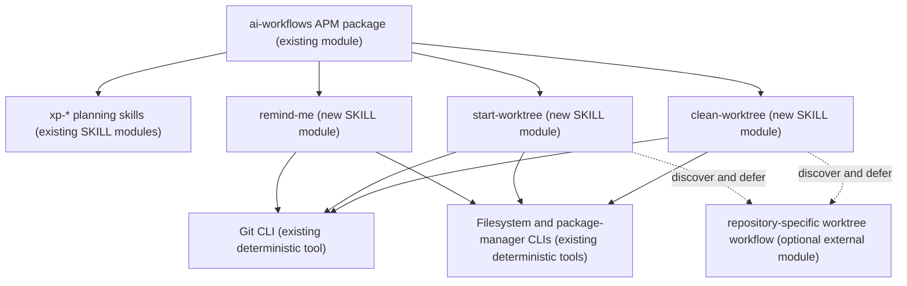
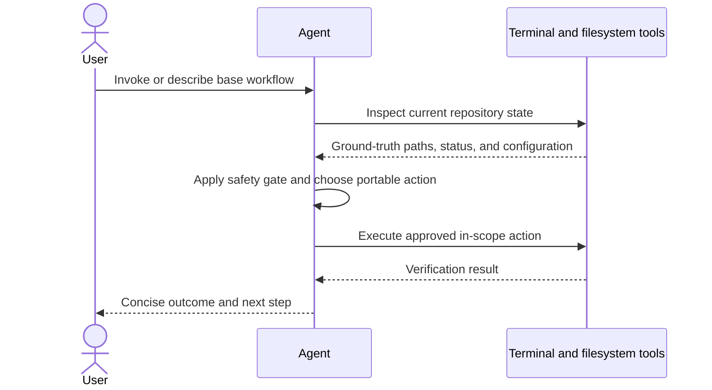
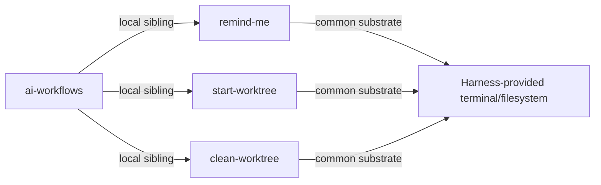

# Base Skills Migration Design

> Superseded package-boundary decision: the skill design remains current, but
> `docs/two-package-design.md` replaces the original single-package distribution
> layout.

## Intent and scope

Turn this package into `ai-workflows`, a personal, cross-harness APM bundle containing the existing XP workflow plus portable base skills migrated from `~/.claude/commands`. The first migration adds session recall and Git worktree lifecycle skills. Version 0.2 adds a private-safe extension point: generic worktree skills defer before mutation when the active repository provides a matching specialized workflow. It does not copy Claude command syntax, embed knowledge of any consuming repository, duplicate the four commands already superseded by `xp-*`, rename the remote repository, or silently delete original command files.

Cost stance: balanced. No cost cap was declared.

## Component diagram

## Thread and execution diagram

The three workflows are independent, single-threaded supervised executions. They do not benefit from subagent fan-out and each consequential mutation is verified by a deterministic tool.

## Dependency graph

## Interfaces

| Module | Trigger description | Inputs | Outputs | Dependencies | Invocation |
|---|---|---|---|---|---|
| `remind-me` | Use when the user wants to resume work, recall recent progress, or determine the next task from repository history and planning folders. | Current repository and optional planning-folder alias. | Evidence-based session summary and suggested next step. | Git and filesystem tools. | BOTH |
| `start-worktree` | Use when the user wants an isolated Git worktree for a feature or task, including local setup needed to begin development. | Task name, current repository, repo-local setup conventions. | Verified worktree path and branch, with setup status. | Git, filesystem, and discovered package-manager tools. | BOTH |
| `clean-worktree` | Use when the user wants to remove a completed Git worktree and its branch safely. | Task name or worktree/branch identity. | Verified cleanup result or a safety stop. | Git and filesystem tools. | BOTH |

Both worktree interfaces first inspect available skills and repository guidance. A matching specialized workflow owns the complete operation; the generic skill invokes it and stops before any partial mutation.

## Composition decisions

| Box | Mode | Rationale |
|---|---|---|
| `remind-me` | LOCAL SIBLING | Independently triggered capability distributed with this bundle. |
| `start-worktree` | LOCAL SIBLING | Consequential creation workflow with its own safety and discovery rules. |
| `clean-worktree` | LOCAL SIBLING | Destructive cleanup workflow must remain separately dispatchable. |
| Git/filesystem/package tools | INLINE common-substrate dependency | Every target harness exposes deterministic tool execution; no packaged module is required. |
| Repository-specific worktree workflow | EXTERNAL MODULE discovered at runtime | Consumers may supply private topology without creating a public dependency or leaking repository knowledge into this package. |

External modules required: none at package install time. A specialized consumer declares and installs its own companion module; the generic skills only expose the discovery/defer protocol. APM is the distribution system, not a runtime dependency of the generic skills.

Declared targets: common-only. APM installs the same skill containers for Claude, Codex, Cursor, OpenCode, and shared `.agents/skills`; skill bodies contain no harness-specific interpolation or tool names.

## Separation-of-concerns and compliance findings

- The four Claude planning commands overlap the existing `xp-*` skills and will not be duplicated.
- `start-worktree` and `clean-worktree` remain separate because their triggers, effects, and safety postures differ.
- Hard-coded `~/dev`, `worktree/`, `npm ci`, and named `.env` files are treated as legacy defaults to discover or confirm, not universal facts.
- Specialized repository names and topology remain outside this public package; a deterministic test rejects private repository terminology in both generic skill bodies.
- Worktree cleanup must resolve exact paths and branch state before mutation and must stop on dirty or unmerged work unless the user explicitly authorizes the risky action.
- Skill names match directory names, remain ASCII, and stay below the entrypoint size limits.
- No open BLOCKER or HIGH findings remain in the design.

## Implementation todo

- [x] Rename package metadata and user-facing documentation to `ai-workflows`.
- [x] Initialize and draft `remind-me`.
- [x] Initialize and draft `start-worktree`.
- [x] Initialize and draft `clean-worktree`.
- [x] Add UI metadata for Codex.
- [x] Add content and trigger eval fixtures outside the publishable `.apm/` tree.
- [x] Validate skill structure, APM packing, and audit output.
- [x] Document global installation into `~/.agents/skills`.

## Evaluation plan

Content evaluations compare runs with and without each skill:

1. In a repository with recent commits and `pensieve/0-Now`, ask, “Remind me where we left off.” Expect grounded commit/branch/status evidence and a next step.
2. In a non-Node repository with local setup documentation, ask for a worktree. Expect setup discovery rather than unconditional `npm ci`.
3. In a dirty or unmerged worktree, ask for cleanup. Expect a stop and explicit warning before any removal.
4. In a repository with a matching specialized worktree skill, ask generic start or clean to proceed. Expect delegation and a complete stop before generic mutation.

Trigger evaluation uses approximately 20 prompts split 60/40 between training and validation:

- Positive families: “remind me,” “where did we leave off,” “create an isolated worktree,” “start work on X separately,” “remove the merged worktree,” and “clean up the feature branch.”
- Near misses: calendar reminders, OS memory questions, ordinary branch creation, deleting arbitrary directories, cleaning build artifacts, and summarizing a repository without session-resumption intent.

Ship gate: each validation positive should select its intended skill and each near miss should avoid it. Forward testing should use temporary repositories only.

## Spawn declarations

No child threads are designed. Per-spawn declaration table, spawn briefs, and receipt schemas are not applicable.

External artifact specification: user-facing summaries use normal prose; repository state is grounded through deterministic tool output.

## Cost projection

| Module | Role class | Prefix | Output | Turns | Cost patterns |
|---|---|---|---|---|---|
| `remind-me` | implementer | S | S | 1-3 | Cache-stable entrypoint; deterministic tool bridge |
| `start-worktree` | implementer | S | S | 2-6 | Cache-stable entrypoint; deterministic tool bridge; supervised execution |
| `clean-worktree` | implementer | S | S | 2-6 | Cache-stable entrypoint; deterministic tool bridge; supervised execution |

Representative ranges, excluding the harness’s fixed system context:

| Scenario | Input tokens | Output tokens | Turns |
|---|---:|---:|---:|
| S: recall in a small repository | 1,000-4,000 | 150-500 | 1-3 |
| M: create and set up one worktree | 2,000-8,000 | 200-800 | 2-6 |
| L: diagnose ambiguous worktrees before cleanup | 4,000-12,000 | 300-1,200 | 3-8 |

Dollar projection is omitted because model selection and pricing belong to each consuming harness and no model target was declared. The balanced stance is satisfied through small stable skill prefixes, no subagent fan-out, and deterministic tools for repository facts and effects.

## Human rationale

This should be one package with multiple cohesive skills, not a second package nested in the repository. APM already provides selective skill installation and multi-target deployment. Retaining the XP namespace preserves existing consumers, while unprefixed personal base skills keep natural invocations such as `$remind-me`. The original Claude command files remain untouched until the APM-installed replacements have been used successfully.
