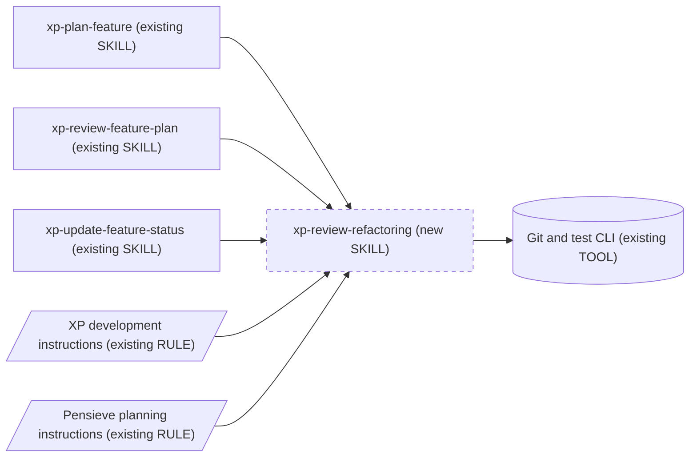
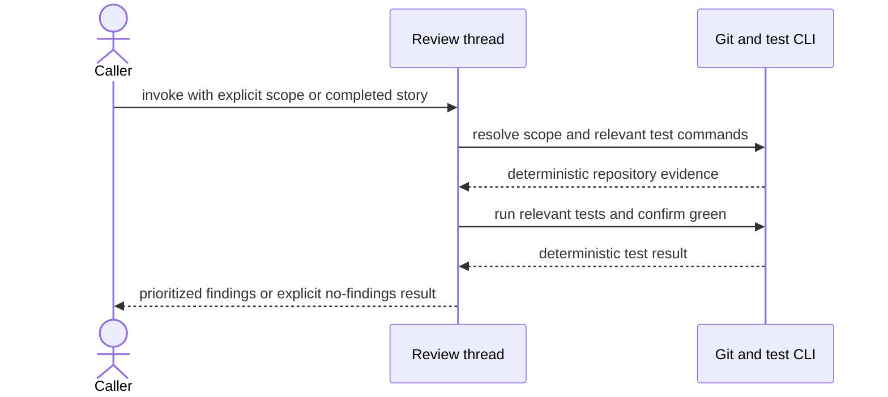
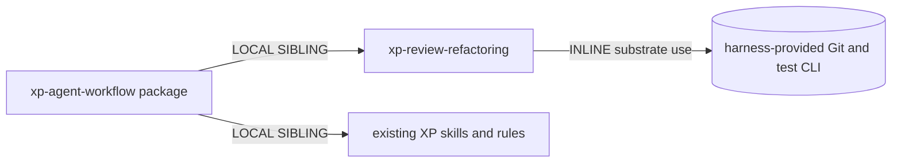

# XP Refactoring Review Design

## Intent and scope

Add one portable `xp-review-refactoring` skill that reviews completed, green
story work and reports concrete test and production-code refactorings. Explicit
file, symbol, task, or diff scope wins; otherwise the skill derives scope from
Git. The skill advises and records findings but does not implement them. The
existing XP instructions and planning skills own per-task cleanup and require a
final story task that invokes this review, resolves actionable findings through
green-preserving refactors, and reruns the relevant suite.

Cost stance: balanced. No cost cap was declared.

## Component diagram

## Execution sequence

The workflow is a single reviewer thread. Test-code and production-code checks
share one clean-code lens and one output, so fan-out would add synthesis cost
without independent state or meaningful context isolation.

## Dependency graph

## Interfaces

| Module | Inputs | Outputs | Dependencies | Invocation |
|---|---|---|---|---|
| `xp-review-refactoring` | Optional explicit code scope; otherwise current repository changes or latest commit | Prioritized, located, mechanically actionable findings; optional `refactoring.md` in the active planning folder | Git, repository test commands | BOTH |
| XP development rule | A completed behavior-change TDD cycle | Green test-code cleanup followed by green production-code cleanup | Existing test runner | FORCED |
| XP planning/review/status skills | Story plan and status | A final review-and-resolve REFACTOR task and completion gate | `xp-review-refactoring` | FORCED |

Dispatch description: Use this skill when reviewing green code for
refactoring opportunities after a story or requested code change, including
when another XP workflow requests the final cleanup review. Accept explicit
files, symbols, tasks, commits, or diffs; otherwise inspect current Git changes.
Review tests and production code, report actionable refactorings, and do not
implement behavior changes.

## Composition

| Component | Mode | Rationale |
|---|---|---|
| Review procedure and rubric | INLINE | One cohesive reviewer capability with one trigger and output. |
| Existing XP skills and instructions | LOCAL SIBLING | They call or enforce the review without duplicating its rubric. |
| Git and repository test runner | Common substrate | Live scope and green status must come from deterministic tools. |
| Evaluation prompts and shell assertions | Maintainer-only | They stay under `dev/`, outside the published package. |

External modules required: none. Declared target: common-only. The skill uses
portable Agent Skills structure and harness-provided terminal/file operations.

## Workflow decisions

- Do not add a per-test refactoring skill. Per-task cleanup is part of the
  existing TDD cycle and always runs in the same context; a second entrypoint
  would create lockstep co-invocation and dispatch overlap.
- Make explicit review scope authoritative. When absent, prefer staged and
  unstaged changes, then the latest commit as a bounded fallback. Do not assume
  a branch name or repository language.
- Require green relevant tests before reviewing. A failing suite is a behavior
  or implementation problem, not a refactoring-only starting point.
- Review tests before production code: business-readable arrange/act/assert
  flow, observable outcomes, meaningful assertions, and duplication balanced
  against clarity; then simple design, names, cohesion, duplication, YAGNI,
  side-effect boundaries, and explanatory-comment replacement.
- Emit only evidence-backed findings with location, rationale, named mechanical
  refactoring, and the tests that preserve behavior. State explicitly when no
  worthwhile refactoring is found.
- Persist `refactoring.md` only when an active feature/story planning folder is
  identifiable; otherwise return the review without inventing a planning tree.

## Compliance

- No R1 split trigger: test and production review are two ordered passes under
  one refactoring lens, not separately invoked capabilities.
- R2 fuse rejects a second per-test skill because it would be tiny and always
  co-invoked with the TDD cleanup rule.
- S7 deterministic tool bridge supplies Git scope and test results.
- S4 validation blocks review until the relevant suite is green.
- No harness-specific syntax or external dependency is required.
- No open BLOCKER or HIGH findings.

## Evaluation plan

Content evaluations compare runs with and without the skill for: an explicit
file scope outside Git diff, a dirty working tree containing tests and
production code, and a completed story with no worthwhile cleanup. Expected
delta: deterministic scope, green gate, tests-first findings, named mechanics,
and no invented issues.

Trigger evaluations cover story-end cleanup, explicit code review for
refactoring, current-diff review, and near misses such as feature-plan review,
general code review, behavior implementation, formatting-only requests, and
failing-test diagnosis. Approximately twenty prompts remain outside the package
under `dev/evals/`, split between training and validation.

## Cost projection

| Module | Role class | Prefix | Output | Turns | Applied patterns |
|---|---|---:|---:|---:|---|
| `xp-review-refactoring` | Reviewer | S | S-M | 2-5 | B13 stable prefix, B14 concise findings, S7 live evidence |

| Workload | Input | Output | Turns |
|---|---:|---:|---:|
| S: one named file | 1,000-4,000 tokens | under 700 tokens | 2-3 |
| M: one completed story | 3,000-12,000 tokens | 400-1,500 tokens | 3-5 |
| L: broad repository diff | 8,000-30,000 tokens | 800-3,000 tokens | 4-8 |

Dollar estimates remain harness-dependent because this common-only skill has no
model binding surface. The balanced stance is met with one reviewer thread,
bounded scope, deterministic Git/test checks, and concise evidence-backed
output.

## Implementation todo

- [x] Add failing deterministic checks and evaluation fixtures.
- [x] Initialize and draft `xp-review-refactoring` with UI metadata.
- [x] Strengthen per-task cleanup and story-end review requirements.
- [x] Update documentation and bump `xp-agent-workflow` to 0.3.0.
- [x] Validate, pack, audit, install globally, and verify discovery.

## Spawn declarations

No child threads are designed. Per-spawn declarations, briefs, and receipt
schemas are not applicable. The external artifact is normal human-readable
review prose or `refactoring.md`.

## Human rationale

The original Claude command has a sound core: inspect a diff, apply simple
design principles to tests and production code, and report concrete fixes. The
portable version removes repository assumptions, hard numeric smell thresholds,
and automatic planning-folder creation. It adds explicit-scope support, a green
test gate, ordered test/production passes, named mechanical refactorings, and a
clear advisory boundary. Per-task cleanup remains a rule because it is part of
every TDD cycle; story-end review becomes a skill because it has a distinct
trigger, scope-resolution process, and reusable output.
