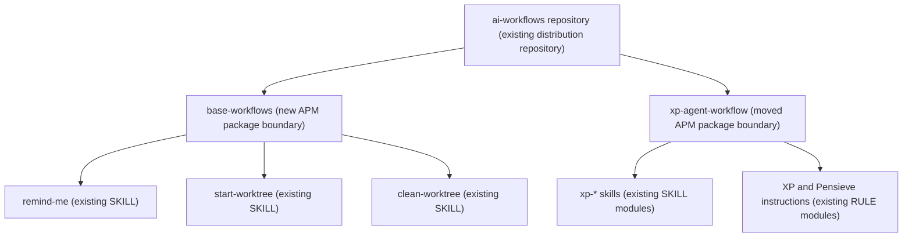
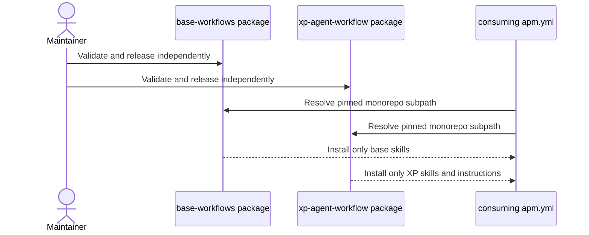
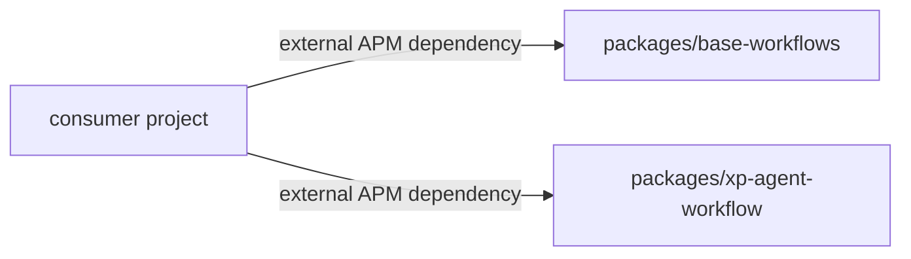

# Two-Package Repository Design

## Intent and scope

Restructure the `ai-workflows` repository into two independently installable APM packages. `base-workflows` owns general cross-harness skills and starts at version `0.1.0`; `xp-agent-workflow` retains the XP instructions and `xp-*` skills at version `0.2.0`. Consuming projects may declare either or both packages in their own `apm.yml`. This change does not duplicate primitives, merge package release histories, or retain the repository root as a third aggregate package.

Cost stance: balanced. No cost cap was declared.

## Component diagram

## Thread and release sequence

No child threads or shared writable sinks are involved. Package validation is sequential because each command runs from a different package root.

## Dependency graph

Neither published package depends on the other.

## Interfaces

| Module | Inputs | Outputs | Dependencies | Invocation |
|---|---|---|---|---|
| `base-workflows` package | APM install of its repository subpath and release ref | Three general skills | None | FORCED through package installation; skills are BOTH |
| `xp-agent-workflow` package | APM install of its repository subpath and release ref | XP skills and reusable instructions | None | FORCED through package installation; skills are BOTH |

## Composition

| Component | Mode | Rationale |
|---|---|---|
| Base skills | INLINE in `base-workflows` | They share one release purpose and user audience. |
| XP skills and instructions | INLINE in `xp-agent-workflow` | They form the existing versioned XP workflow. |
| Two packages | LOCAL SIBLING packages | Same maintainer and repository, independent installation and release cadence. |
| Consumer relationship | EXTERNAL MODULE | Projects pin either or both packages through APM. |

External module declaration mechanism: consumer `apm.yml` manifest entries. This repository documents the entries but neither sibling declares the other.

Declared targets: common-only for skills. XP instruction compilation remains controlled by each consuming harness and repository.

## Separation-of-concerns and compliance

- Fixes the existing R1 SPLIT trigger: base and XP capabilities have different consumers and release histories.
- Removes the accidental aggregate package that caused APM `includes: auto` to ship both sets together.
- Keeps the `v0.1.0` Git tag as historical proof of the original XP package and preserves `xp-agent-workflow` version `0.2.0` in its new package manifest.
- Starts `base-workflows` at `0.1.0`; repository tags should be package-qualified for independent releases.
- Keeps eval artifacts outside both publishable `.apm/` directories.
- No dispatch descriptions or skill bodies change, so existing skill eval results remain applicable.
- No open BLOCKER or HIGH findings.

## Implementation todo

- [x] Create `packages/base-workflows` and move only the base skill sources into it.
- [x] Create `packages/xp-agent-workflow` and move only XP skills and instructions into it.
- [x] Give each package an independent `apm.yml` and lockfile.
- [x] Remove the root package manifest and root `.apm` source tree.
- [x] Update documentation with a consumer `apm.yml` containing both packages.
- [x] Pack and audit each package independently.
- [x] Verify each bundle contains no primitives from its sibling.

## Evaluation plan

Content and trigger behavior is unchanged from the existing skill evals. The new package-boundary evaluations are deterministic:

1. Pack `base-workflows`; expect exactly `remind-me`, `start-worktree`, and `clean-worktree`, with no `xp-*` skills or instructions.
2. Pack `xp-agent-workflow`; expect the four `xp-*` skills and two reusable instructions, with no base skills.
3. Install both local packages into a temporary consumer project; expect all seven skills and one consumer lockfile without collisions.

The existing approximately twenty base-skill trigger cases remain in `dev/evals/base-skills.json`. XP behavior remains covered by its existing source and pilot evaluation guidance.

## Spawn declarations

No child threads are designed. Per-spawn declarations, spawn briefs, and receipt schemas are not applicable.

External artifact specification: package documentation and consumer examples use normal prose.

## Cost projection

| Workload | Input | Output | Turns |
|---|---:|---:|---:|
| S: pack one package | 500-2,000 tokens | under 500 tokens | 1-2 |
| M: validate both packages | 1,000-4,000 tokens | under 800 tokens | 2-4 |
| L: diagnose a consumer collision | 2,000-8,000 tokens | under 1,200 tokens | 3-6 |

Both package modules use an implementer role class, small stable prefixes, and deterministic APM/Git tool bridges. No fan-out is designed. Dollar estimates remain harness-dependent and no model target was declared.

## Human rationale

Repository identity and package identity are separate. A monorepo is useful because these workflows share maintenance and documentation, while subpath packages preserve the install and version boundaries the user expects. Committed `apm pack` bundles are the visible release history; package-qualified tags such as `base-workflows-v0.1.0` and `xp-agent-workflow-v0.2.0` provide additional immutable Git markers.
