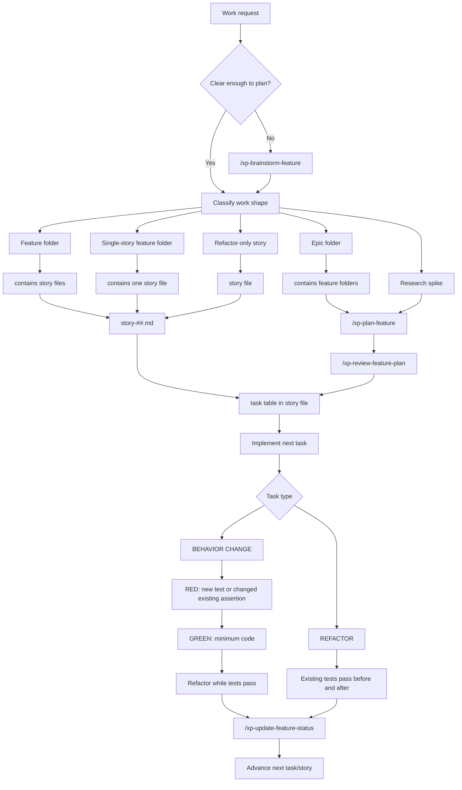

# XP Workflow Usage

The `ai-workflows` package ships a namespaced XP workflow that can run beside
the package's portable base skills and existing hand-copied prompts.

## Commands

Use these commands to try the packaged workflow:

```text
/xp-brainstorm-feature
/xp-plan-feature
/xp-review-feature-plan
/xp-update-feature-status
```

Existing prompts such as `/plan-feature` are not replaced.

## Workflow



## Work Shape Vs Task Type

Work shape answers "how big is this work?"

- Epic: multiple features.
- Feature: several independently shippable stories.
- Single-story feature: one shippable behavior with multiple tasks.
- Refactor-only story: structural change with no behavior change.
- Research spike: unknowns must be resolved before planning stories.

Task type answers "what kind of step is this?"

- BEHAVIOR CHANGE: add a new test or change an existing assertion to the new expected behavior, confirm RED, then make it pass.
- REFACTOR: preserve behavior; existing tests pass before and after each small mechanical step.

Tasks live in the story markdown file, in the story's task table and task detail sections. The workflow does not create separate task files.

## Package Boundary

This package should own reusable workflow behavior:

- XP/TDD discipline.
- Work-shape classification.
- Story/task planning conventions.
- Status update discipline.
- Refactoring mechanics.

Repos should own local facts:

- Test commands.
- Architecture.
- Ports.
- Runtime versions.
- Repo-specific conventions.

## Side-By-Side Evaluation

Use old and new prompts on similar planning tasks:

```text
/plan-feature some-feature
/xp-plan-feature some-feature
```

Compare:

- Did the new workflow classify work size correctly?
- Did it avoid unnecessary story nesting?
- Did it distinguish BEHAVIOR CHANGE from REFACTOR clearly?
- Did it remember status updates?
- Did it stay lightweight enough to use repeatedly?
